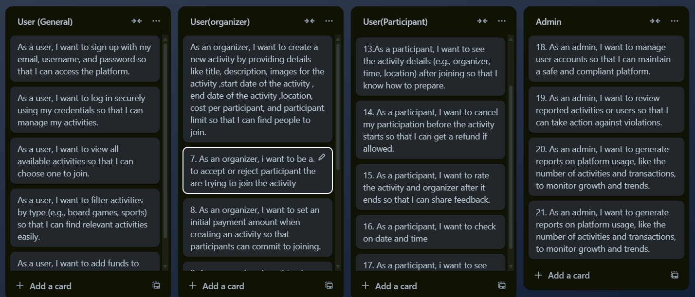
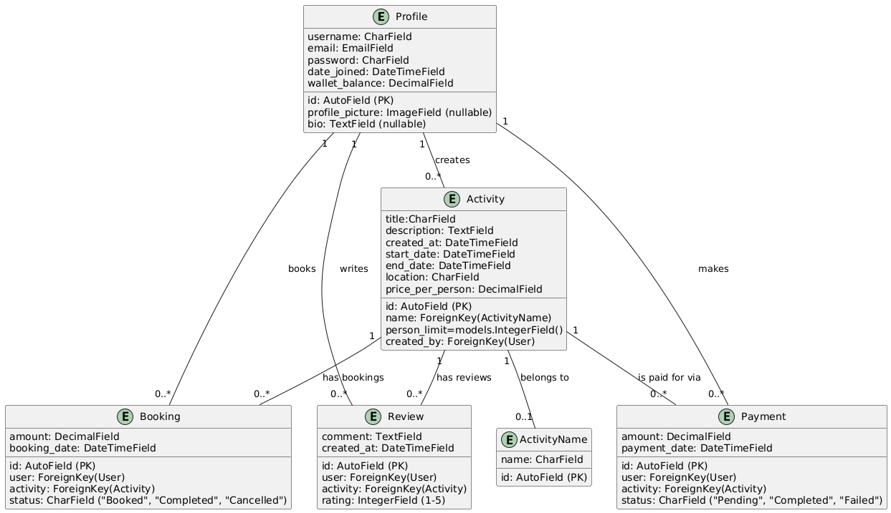

## (Project Name)
ChampArena

- **Overview:** 
Our solution is to create a user-friendly website that connects individuals looking for participants for real-life games or sports. The platform will act as a virtual meeting point for people with similar interests, making it easy to organize activities such as Chess, Baloot, football, and other sports or games.	

## features
General Users:

Sign up / Log in securely
View and filter activities
Add funds to wallets for payments
Organizers:

Create, manage, and mark activities
Manage participants (accept/reject)
Participants:

Join activities and cancel participation
Rate activities and organizers
Admins:

Manage users and activities
Monitor platform usage
Payment Integration:

Secure payments, wallet usage, and transaction history

## User Stories

## UML
- 

## Wireframes
# [(wireframe link here.)](https://www.figma.com/design/U5yB0z0VeRxOMvCXOX9qLI/capstone?node-id=0-1&t=DZAUdJvwgCxnhwWY-1)